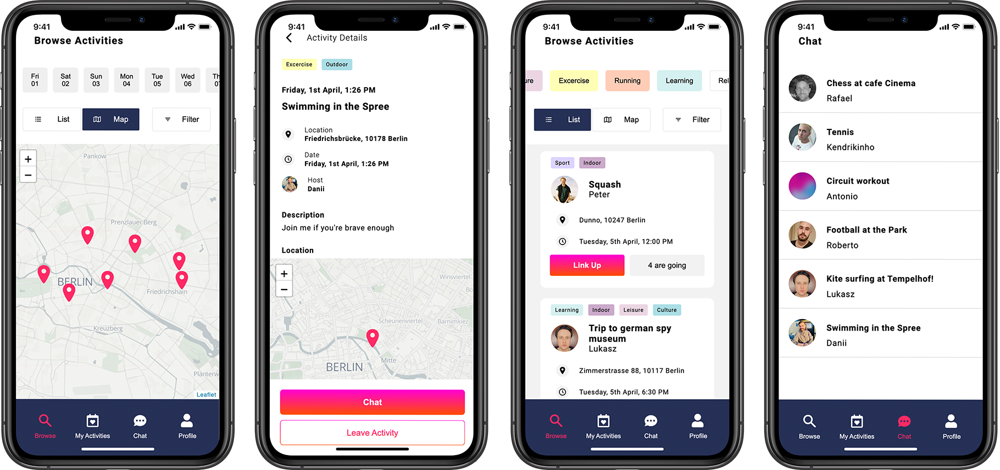

# LinkUp

<p align="center">
  
</p>

LinkUp is an app for creating and joining events based on shared interests. The App will enable people to meet existing friends and make new friends through activities such as sports, games, excursions. Users are able to communicate via a group chat, based on event participants. The mission of the app is to enable people who want to make new friends to do so via their shared interests. Furthermore, established friend groups will have a forum to create and organize their activities.

## Screenshots

<p align="center">
  
</p>

## Getting Started

1. Clone this repo.

    ```bash
    git clone https://github.com/rbrtrfl/linkup
    ```

2. Install dependencies in root, server and client folder.

    ```bash
    npm install
    ```

3. Create .env file in client folder

    ```bash
    REACT_APP_BASE_URL=
    REACT_APP_ESRI_API_KEY=
    REACT_APP_SOCKET_URL=
    REACT_APP_CLOUDINARY_UPLOAD_PRESET=
    REACT_APP_CLOUDINARY_CLOUD_NAME=
    ```

4. Create .env file in server folder

    ```bash
    DATABASE_URL=
    SOCKET_URL=
    SERVER_URL=
    SERVER_PORT=
    ```

5. Install [PostgreSQL](https://wiki.postgresql.org/wiki/Homebrew) on your machine

6. Run `psql postgres` to start psql CLI. Inside psql CLI run the following commands to create the database

    ```bash
    create database linkup_db;
    quit
    ```

7. Generate Prisma artifacts (e.g. Prisma Client) and sync database schema with prisma schema

    ```bash
    npx prisma generate
    npx prisma db push
    ```

    For further information on server and database, check out the [readme](https://github.com/rbrtrfl/linkup/tree/dev/server) of the server

5. Start the server. From the server folder, run

    ```bash
    npx nodemon ./index.ts
    ```

6. Start the client. From the client folder, run

    ```bash
    npm start
    ```

## Tech Stack

* [React](https://reactjs.org/)
* [Leaflet](https://leafletjs.com/)
* [Node.js](https://nodejs.org/)
* [Express](https://expressjs.com/)
* [PostgreSQL](https://www.postgresql.org/)
* [Prisma](https://www.prisma.io/)
* [Socket.io](https://socket.io/)

